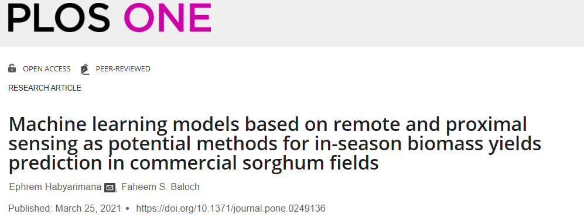
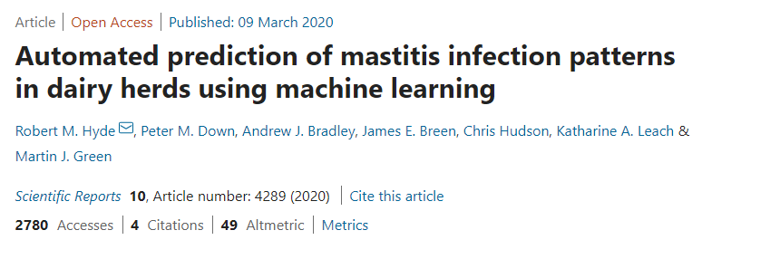

```{r setup, include=FALSE}
knitr::opts_chunk$set(echo = TRUE, warning = FALSE, message = FALSE)

# Learn more about creating blogs with Distill at:
# https://rstudio.github.io/distill/blog.html

```

# Algortimo `xgboost`

## Generalidades

## Implementación en R

## Documentación `xgboost`

- [Documentación oficial `xgboost`](https://xgboost.readthedocs.io/en/latest/#)
- [Biblioteca `xgboost` en R](https://cran.r-project.org/web/packages/xgboost/xgboost.pdf)
- [Tutorial de `xgboost` en R](https://xgboost.readthedocs.io/en/latest/R-package/xgboostPresentation.html)

# Datos de ejemplo

En este documento se pretende mostrar cómo implementar el algoritmo `xgboost` con R a través de la biblioteca que lleva el mismo nombre y haciendo uso del [`tidymodels`.](https://www.tidymodels.org/) Para ejemplificar el ajuste de *modelos de clasificación* se obtuvieron datos de ejemplo aplicado en ciencias animales, especificamente en la detección de patrones de infección de mastitis en vacas.

## Clasificación: detección de mastitis

- [Artículo publicado en PLOS ONE](https://journals.plos.org/plosone/article?id=10.1371/journal.pone.0249136)

<center>

</center>

## Regresión: predicción de la producción de sorgo

- [Artículo publicado en Nature](https://www.nature.com/articles/s41598-020-61126-8#Sec15)

<center>

</center>

# Requisitos previos

- Para replicar este documento es necesario instalar las siguientes bibliotecas:
  - **`tidyverse`:** manipulación  y visualización de datos.
  - **`readxl`:** lectura de datos en formato de Excel.
  - **`janitor`:** manipulación de datos.
  - **`skimr`:** análisis descriptivo y exploratorio de datos. 
  - **`tidymodels`:** entrenamiento y evaluación de modelos de machine learning.
  - **`xgboost`:** algoritmo `xgboost`. 
  - **`vip`:** calcular importancia de variables.
  - **`tidyquant`:** (opcional) definición de tema (`theme_tq()`) para gráficos con `ggplot2`.
- Descargar los datos para cada ejemplo:
  - [Datos para detección de mastitis](https://www.nature.com/articles/s41598-020-61126-8#Sec15)
  - [Datos de producción de sorgo](https://journals.plos.org/plosone/article?id=10.1371/journal.pone.0249136#sec014)

# Bibliotecas

```{r}
library(tidyverse)
library(readxl)
library(skimr)
library(janitor)
library(tidymodels)
library(xgboost)
library(tidyquant)
library(vip)
```

# Tema para `ggplot2`

```{r}
theme_set(theme_tq())
```

# Detección de mastitis

- La variable respuesta está identificada como `diagnosis`. En principio tiene 4 niveles, sin embargo, para el ejemplo fueron filtrados sólo los niveles `EDP` (transmisión en el período seco - sin lactancia) y `EL` (transmisión en período de lactancia).
- La base de datos consta de 1000 observaciones y 229 variables, es decir, que existen 228 variables predictoras. Cuando se aplicó el filtro quedaron 914 observaciones.

## Base de datos

```{r}
mastitis <- read_csv("data/mastitis.csv") %>% 
  clean_names() %>% 
  filter(diagnosis %in% c("EDP", "EL"))

mastitis %>% head()
```

## Análisis exploratorio

- **Frecuencia de variable respuesta:**

```{r, fig.cap="Frecuencia absoluta de variable respuesta"}
mastitis %>% 
  count(diagnosis) %>% 
  ggplot(aes(x = diagnosis, y = n)) +
  geom_col(color = "dodgerblue3", fill = "dodgerblue3", alpha = 0.8) +
  geom_label(aes(label = n)) +
  labs(x = "Diagnóstico", y = "Frecuencia")
```

## Train y Test

## Tuning con `tidymodels`

## Desempeño del modelo

## Importancia de variables

# Producción de sorgo

## Base de datos

## Análisis exploratorio

## Train y Test

## Tuning con `tidymodels`

## Desempeño del modelo

## Importancia de variables

# Recursos de información

