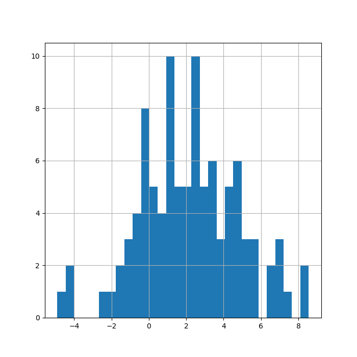
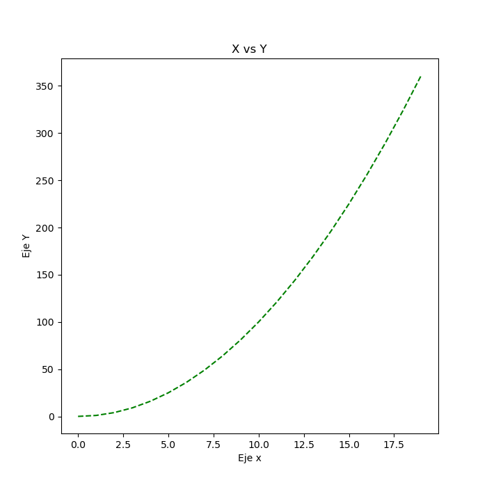
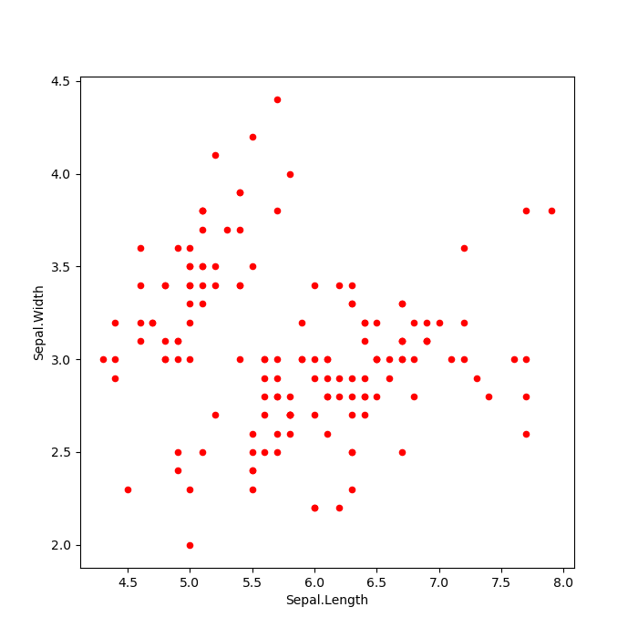

```{r setup, include=FALSE}
knitr::opts_chunk$set(echo = TRUE,
                      warning = FALSE,
                      message = FALSE,
                      fig.align = "center")

# Learn more about creating blogs with Distill at:
# https://rstudio.github.io/distill/blog.html

```

# Requisitos previos

- Tener instalado [Python](https://www.python.org/)
- Recomendable instalar [Anaconda Navigator](https://anaconda.org/anaconda/anaconda-navigator)
- Instalar la biblioteca [`reticulate`](https://rstudio.github.io/reticulate/index.html) desde R.

# Biblioteca Reticulate

<center>

</center>

```{r}
library(reticulate)
```

# Importando módulos de *python*

## Importando `numpy`

```{r}
np <- import("numpy")
np$argmin(c(2, 1, 3))
```

- En esta salida se muestra cómo aplicar la función `arcgmin` de *python* sobre un vector de *R*. Devuelve la posición (índice) donde se encuentra el valor mínimo del vector dado.
- Es posible acceder a todas las funciones de `numpy` desde el objeto `np` con el símbolo dólar `$`.

<center>

</center>

## Importando `os`

```{r}
os <- import("os")
os$getcwd()
```

# Usando *python*

```{python}
import numpy as np
np.argmax(np.array([1, 4, 10]))
```

# Función de *python* llamada por *R*

- Declarando la función en *python*:

```{python}
def add(x, y):
  return x + y
  
add(2, 2)  
```

- Llamando la función `add()` desde *R*

```{r}
py$add(2, 2)
```

# Usando `numpy`

```{python}
np.arange(0, 5)
```

```{python}
np.arange(0, 10, 2)
```

```{python}
np.ones((2, 2))
```

- **Simulando 100 valores aleatorios de la distribución normal, con media 2 y varianza 3:**.

```{python}
np.random.seed(1)
valores = np.random.normal(loc = 2, scale = 3, size = 100)
valores
```

# Gráfico con `matplotlib`

```{python, eval = FALSE}
import matplotlib
import matplotlib.pyplot as plt

fig, g1 = plt.subplots()
g1 = g1.hist(valores, bins = 30)
g1 = plt.grid()
g1
```

<center>

</center>

# Ayudas

```{r}
os <- import("os")
py_help(os$chdir)
```

En el editor de texto aparecerá el siguiente texto:

<center>

</center>

# Objetos

## Tupla desde *R*

- Creando una tupla y obteniendo su clase:

```{r, collapse=TRUE}
tupla1 <- tuple(c(1, 2, 3, "A"))
tupla1

# Clase en python
class(tupla1)
```

- Coercionar el objeto `tupla1` de clase `tuple` en *python* directamente a *R*:

```{r, collapse=TRUE}
tupla1_r <- py_to_r(tupla1)
tupla1_r

# Clase en R
class(tupla1_r)
```

## Diccionario desde *R*

```{r, collapse=TRUE}
# Objeto
dict1 <- dict(x = "Hola", y = 3.5, z = 1L)
dict1

# Clase
class(dict1)

# Nombres
names(dict1)

# Atributos
attributes(dict1)

# Coerción a objeto R
dict1_r <- py_to_r(dict1)
dict1_r

# Clase en R
class(dict1_r)
```

## Tupla en *python*

- Creando tupla en *python*:

```{python}
# Creando tupla
altura = (1.65, 1.72, 1.56, 1.84, 1.92)
altura
```

```{python}
# Otra tupla
peso = (67, 75, 67, 78, 85)
peso
```

```{python}
# Tipo (clase) de objetos
type(altura)
type(peso)
```

- Llamando la tupla desde *R*:

```{r, collapse=TRUE, fig.align='center'}
class(py$altura)
plot(x = py$altura, y = py$peso, pch = 19, cex = 2)
```

## Tipos de objetos en ambos lenguajes

<center>

</center>

# Índices

- Desde *python*:

```{python}
altura
```

```{python}
altura[0]
```

- En *R*:

```{r}
py$altura[1]
```

# Instalando un módulo de *python* desde *R*

## Instalando `pandas`

```{r, eval = FALSE}
py_install("pandas")
```

## Importando `pandas` y leyendo archivo *.csv*

```{python}
import pandas as pd
iris_py = pd.read_csv("Iris.csv")
iris_py
```

```{python}
type(iris_py)
```

- Estadísticos descriptivos:

```{python}
iris_py.describe()
```

- Seleccionando variables por nombre:

```{python}
iris_py[["Sepal.Length", "Sepal.Width"]]
```

- Filtrando datos:

```{python}
filtro = iris_py["Sepal.Width"] <= 2.2
iris_py[filtro]
```

- `Dataframe` como `array`:

```{python}
iris_py.values
```


## Importando `tensorflow` desde python

```{python, eval = FALSE}
import tensorflow as tf
```

- Funciones desde `tf`:

<center>

</center>

# Visualizando datos con `matplotlib`

## Ejemplo 1

```{python, eval= FALSE}
import matplotlib.pyplot as plt
x = np.arange(0, 20)
y = x**2
g1 = plt.plot(x, y, "g--")
g1 = plt.title("X vs Y")
g1 = plt.xlabel("Eje x")
g1 = plt.ylabel("Eje Y")  
g1
```

<center>

</center>

## Ejemplo 2

```{python}
w = np.arange(0, 50).reshape(5, 10)
w
```

```{python, eval= FALSE}
g2 = plt.imshow(w)
g2 = plt.colorbar()
plt.show()
```

<center>

</center>

## Ejemplo 3

- Gráfico desde un `Dataframe`:

```{python, eval= FALSE}
g3 = iris_py.plot(x = "Sepal.Length", y = "Sepal.Width", kind = "scatter",
                  color = "red")                 
g3
```

<center>

</center>


